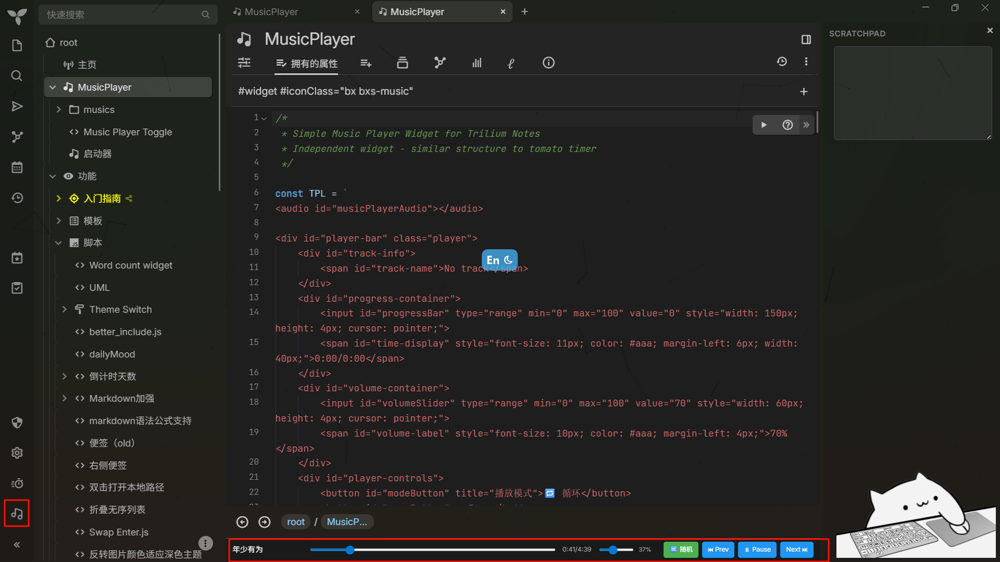
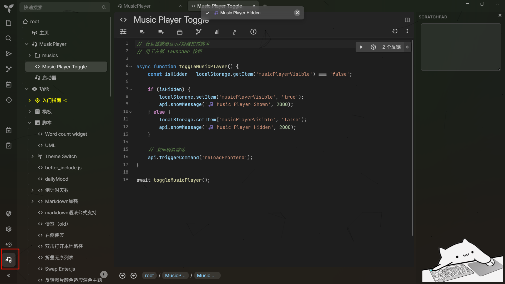
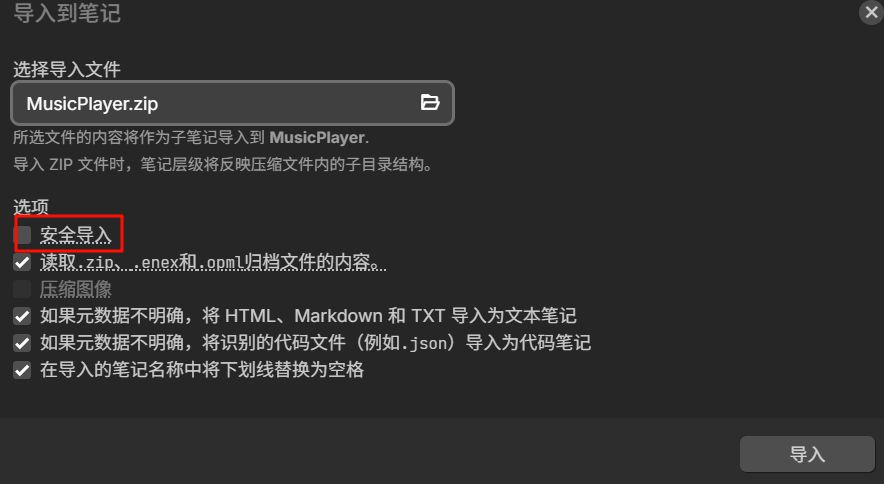
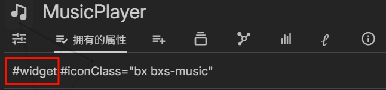
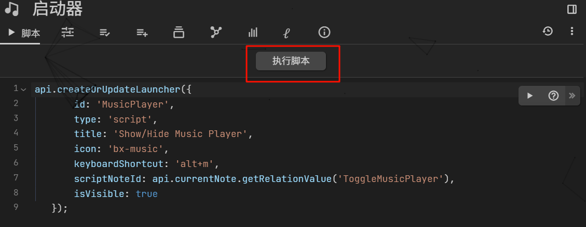
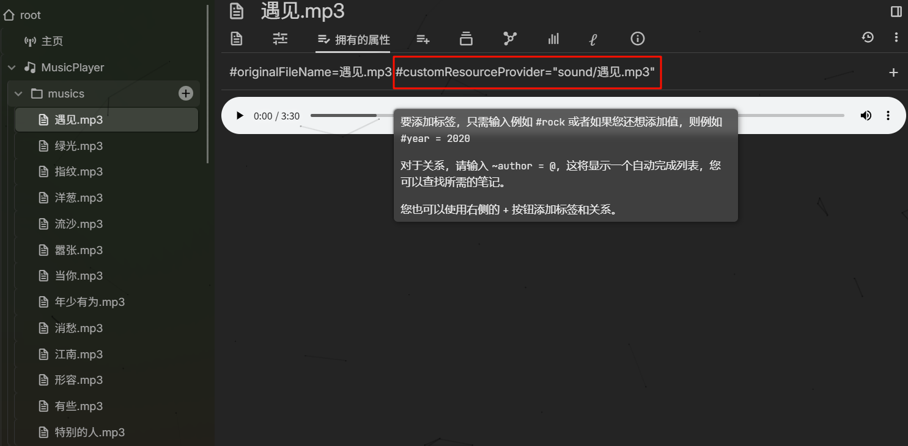
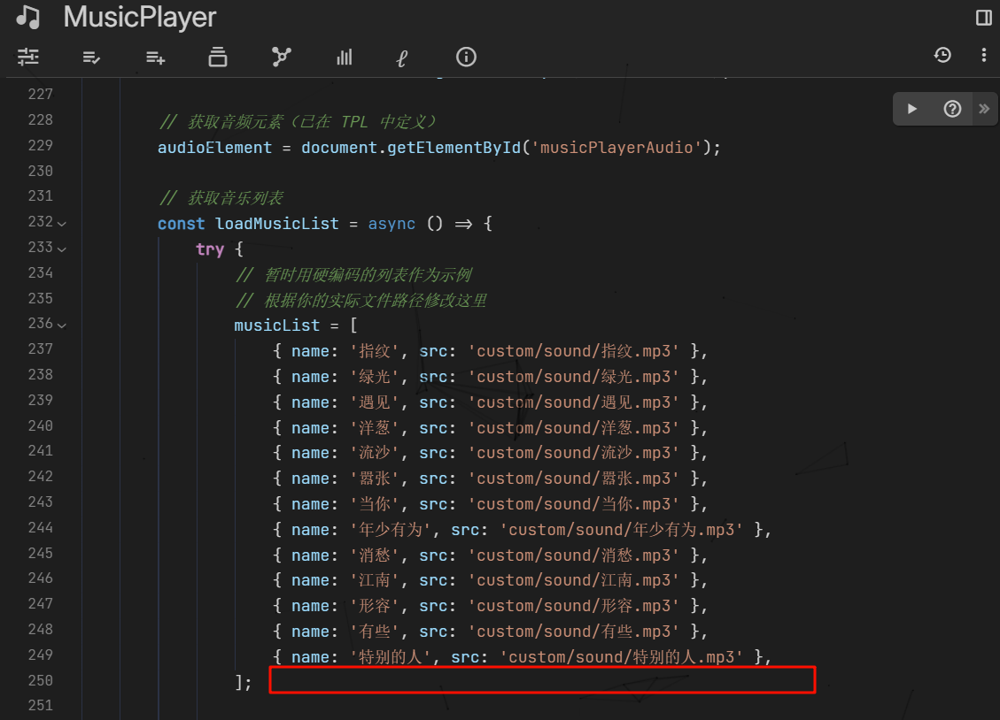

显示：

隐藏：

导入：
关闭安全导入

添加#widget标签：

执行脚本：

左侧边栏会出现控制按钮：（用于控制显示与隐藏播放器）

添加音乐：
拖拽音乐到musics文件夹 添加属性#customResourceProvider  值：sound/音乐文件名.mp3

在MusicPlayer中加入播放列表：(路径前缀不变 只改变文件名.mp3)

完成，ctrl+r 重启前端 即可体验